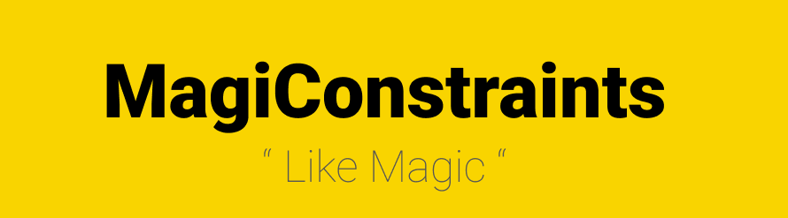

## MagiConstraints
Syntactic sugar for AutoLayout to speed up making constraints in one-line-function like magic ✨

<p align="center">
    
</p>

## Features

- [X] Constraints are active by default.
- [X] No need to set `translatesAutoresizingMaskIntoConstraints` because `MagiConstraints` does it for you.
- [X] Satisfy all constraints `X-axis`, `Width`, `Y-axis` & `Height` in one line function `magiConstraints()`
- [X] by covering different ways to statisfy each constraint using `enum` parameters
- [X] also have `miniConstraints()` function to use constraints individually 
- [X] create dynamic `UIScrollView` by one line function `magiCreate`
- [X] create `UIStackView` by one line function `magiCreate`


## Example

To run the example project, clone the repo, and run `pod install` from the Example directory first.

```swift 
    import 'MagiConstriants'
```

### ViewController

```swift 
// Views
var scrollView = UIScrollView()
var containerView = UIView()
var label = UILabel()
var greenView = UIView()
var stackView = UIStackView()
var view1 = UIView()
var view2 = UIView()
var view3 = UIView()
```

### ViewDidLoad

```swift
view.addSubview(scrollView)
scrollView.magiCreate(container: containerView)
containerView.addSubviews([label, greenView])

greenView.addSubview(stackView)
let subviews = [view1, view2, view3]
stackView.magiCreate(subviews: subviews, direction: .vertical, distribution: .fillEqually(20))

// magic constraints ( satisify all constraints in one line )
label.magiConstraints(XW: .leadingAndCenter(nil, 20), YH: .TopAndBottom(nil, 20, greenView, 20))
greenView.magiConstraints(XW: .leadingAndCenter(nil, 20), Y: .bottom(nil, 20), H: .fixed(500))
stackView.magiConstraints(XW: .leadingAndCenter(nil, 20), YH: .topAndCenter(nil, 20))
```


## Installation

MagiConstriants is available through [CocoaPods](https://cocoapods.org). To install
it, simply add the following line to your Podfile:

```ruby
pod 'MagiConstriants'
```

## Usage 

Constraints behave different if it's attach to `superview` or `any other view`

 `nil = superview` by default, so its easy to change superview without change alot of code 

### superview :
- [X] leading to `leading` of  superview
- [X] trailling to `trailing` of superview
- [X] top to `top` of superview
- [X] bottom to `bottom` of superview

### any other view :
- [X] leading to `trailing` of view
- [X] trailling to `leading` of view
- [X] top to `bottom` of view
- [X] bottom to `top` of view

### `💡 Look at the documentation part to discover different cases for each constraint enum parameter !`

### addSubviews ( Examples )
```swift
view.addSubviews([subview1, subview2, subview3])
```

### magiConstraints ( Examples )
```swift
// XWYH 
view1.magiConstraints(X: .center(nil), W: .fixed(500), Y: .center(nil), H: .wrapContent)
view1.magiConstraints(X: .leading(nil, 20), W: .wrapContent, Y: .top(nil, 20), H: .equal(view2, 0.5))

// XW, Y, H
view1.magiConstraints(XW: .leadingAndCenter(nil, 20), Y: .top(nil, 20), H: .wrapContent)
view1.magiConstraints(XW: .leadingAndTrailing(nil, 20, view2, 20), Y: .center(nil), H: .fixed(500))

// X, W, YH
view1.magiConstraints(X: .center(nil), W: .equal(nil, 0.75), YH: .TopAndBottom(nil, 20, view2, 20))
view1.magiConstraints(X: .leading(view2, 20), W: .equal(nil, 1), YH: .topAndCenter(nil, 20))

// XW, YH
view1.magiConstraints(XW: .leadingAndCenter(nil, 20), YH: .topAndCenter(nil, 20))
view1.magiConstraints(XW: .leadingAndTrailing(nil, 10, nil, 10), YH: .bottomAndCenter(nil, 20))
```
### miniConstraints ( Examples )
```swift
// Size Only - W, H
view1.miniConstraints(W: .fixed(500), H: .wrapContent)

// Position Only - X, Y
view1.miniConstraints(X: .center(nil), Y: .bottom(view2, 20))

// X Only
view1.miniConstraints(X: .leading(nil, 20))

// W Only
view1.miniConstraints(W: .equal(view2, 0.5))

// Y Only
view1.miniConstraints(Y: .center(nil))

// H Only
view1.miniConstraints(H: .wrapContent)

// XW Only
view1.miniConstraints(XW: .leadingAndTrailing(nil, 20, nil, 20))

// YH Only
view1.miniConstraints(YH: .topAndCenter(nil, 20))
```
### Dynamic UIScrollView ( Examples )
```swift
// magiCreate
view.addSubview(scrollView)
scrollView.magiCreate(container: containerView)
containerView.addSubviews([view1, view2])

```
### UIStackView ( Examples )
```swift
// magiCreate 
view.addSubview(stackView)
stackView.magiCreate(subviews: subviews, direction: .vertical, distribution: .fillEqually(20)) // spacing = 20
```

## Documentation ( Enum Cases )

### X 
| X-axis | description |
| ------------- | ------------- |
| leading | takes 2 parameters `UIView` for the view and `CGFloat`  for constant padding value |
| trailing  | takes 2 parameters `UIView` for the view and `CGFloat`  for constant padding value |
| center  | takes 1 parameter `UIView` for the view ( center horizontally ) |

### W
| Width | desciption |
| ------------- | ------------- |
| wrapContent | dynamic width grows and shrinks according to the content of the view |
| fixed  | takes 1 parameter `CGFloat`  for constant width value |
| equal  | takes 2 parameters `UIView` for the view and `CGFloat`  for multiplier value |

### Y
| Y-axis | description |
| ------------- | ------------- |
| top | takes 2 parameters `UIView` for the view and `CGFloat`  for constant padding value |
| bottom  | takes 2 parameters `UIView` for the view and `CGFloat`  for constant padding value |
| center  | takes 1 parameter `UIView` for the view ( center vertically ) |

### H
| Height | desciption |
| ------------- | ------------- |
| wrapContent | dynamic width grows and shrinks according to the content of the view |
| fixed  | takes 1 parameter `CGFloat`  for constant height value |
| equal  | takes 2 parameters `UIView` for the view and `CGFloat`  for multiplier value |

### XW
| X-axis & Width | description |
| ------------- | ------------- |
| leadingAndCenter | takes 2 parameters `UIView` for the view and `CGFloat`  for constant padding value ( Always center Horizontally to the superview |
| trailingAndCenter  | takes 2 parameters `UIView` for the view and `CGFloat`  for constant padding value ( Always center Horizontally to the superview |
| leadingAndTrailing  | takes 4 parameters `UIView` for the leadingView and `CGFloat`  for constant padding value + another `UIView` for the trailingView and `CGFloat`  for constant padding value |
| leadingAndTrailingAndHeight  | takes 5 parameters `UIView` for the leadingView and `CGFloat`  for constant padding value + another `UIView` for the trailingView and `CGFloat`  for constant padding value + `W` enum as a parameter to set the Width |

### YH
| Y-axis & Height | description |
| ------------- | ------------- |
| topAndCenter | takes 2 parameters `UIView` for the view and `CGFloat`  for constant padding value ( Always center vertically to the superview |
| bottomAndCenter | takes 2 parameters `UIView` for the view and `CGFloat`  for constant padding value ( Always center vertically to the superview |
| topAndBottom | takes 4 parameters `UIView` for the topView and `CGFloat`  for constant padding value + another `UIView` for the bottomView and `CGFloat`  for constant padding value |
| topAndBottomAndHeight | takes 5 parameters `UIView` for the topView and `CGFloat`  for constant padding value + another `UIView` for the bottomView and `CGFloat`  for constant padding value + `H` enum as a parameter to set the Height |

## Author

BelalSamy, belalsamy10@gmail.com

## License

MagiConstriants is available under the MIT license. See the LICENSE file for more info.
